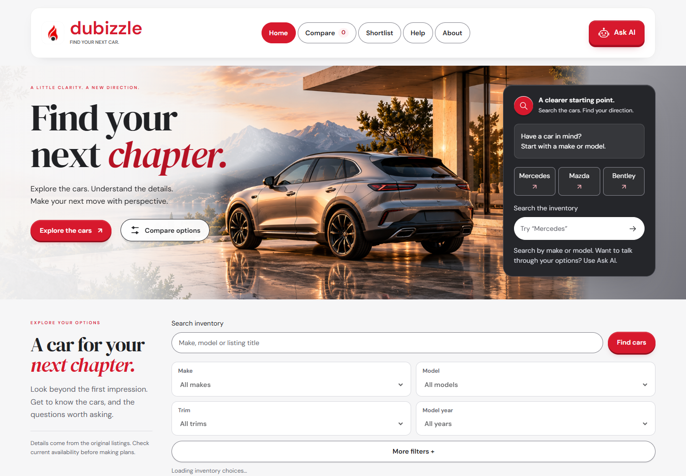
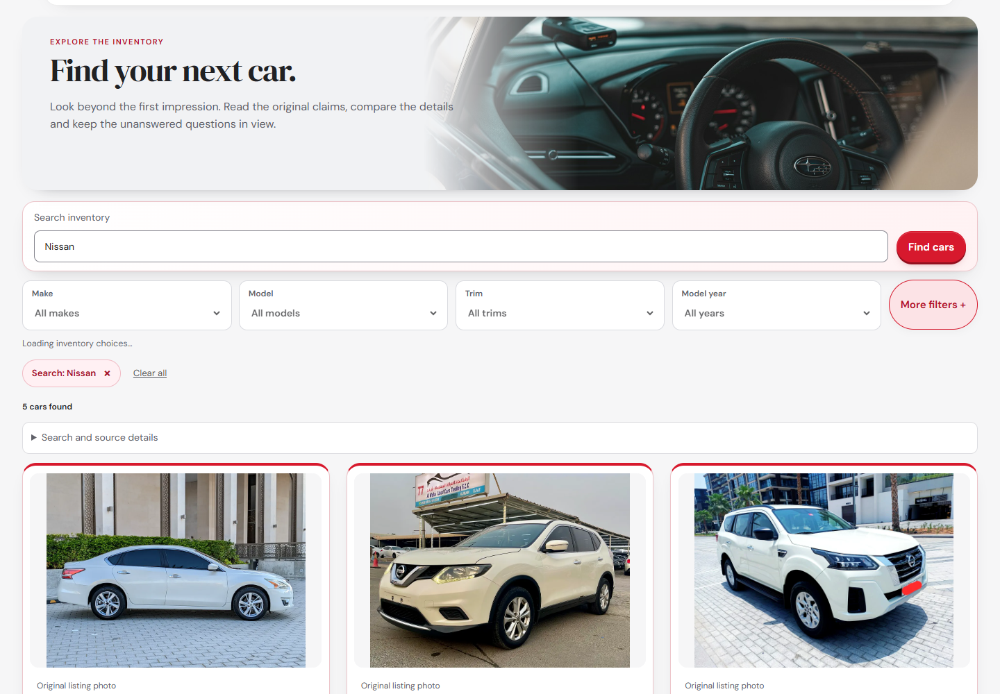
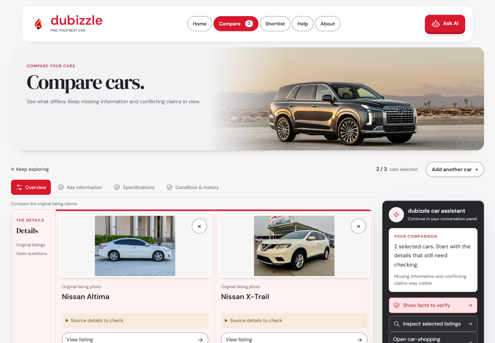
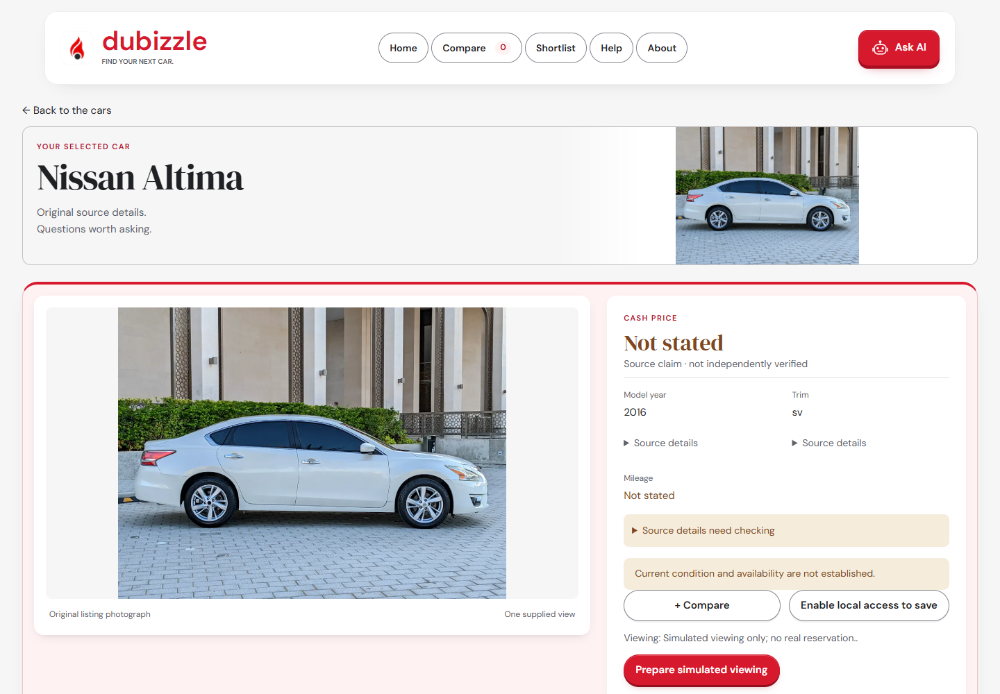
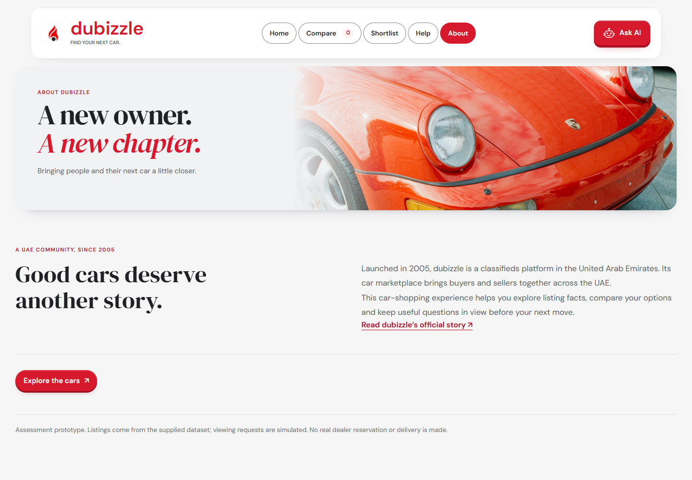
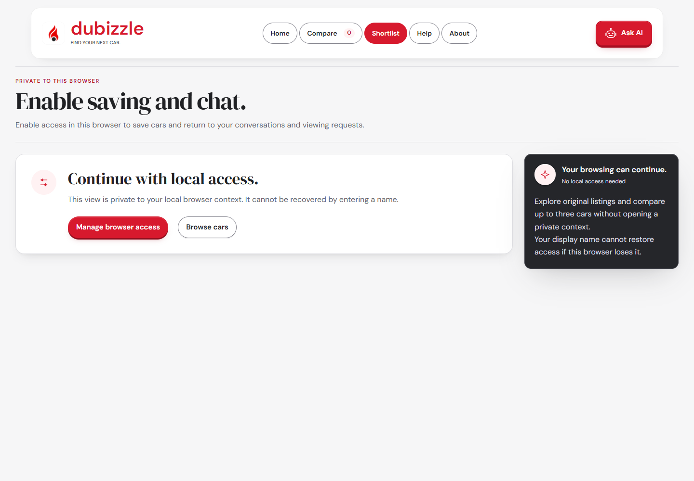
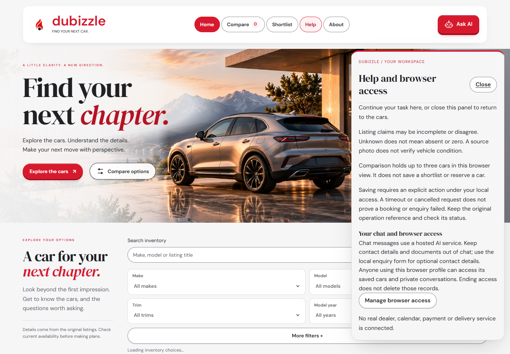
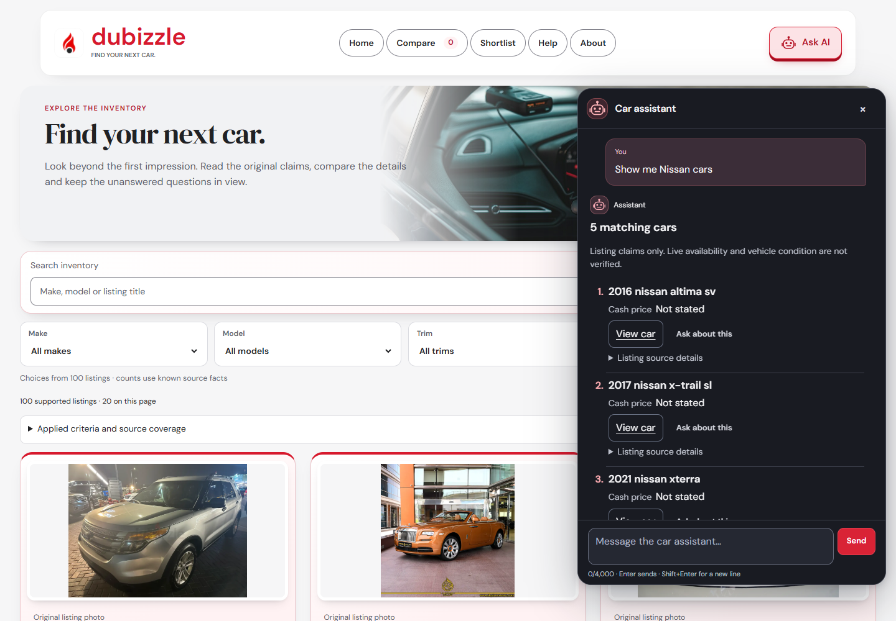
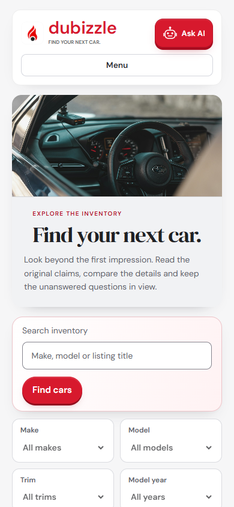
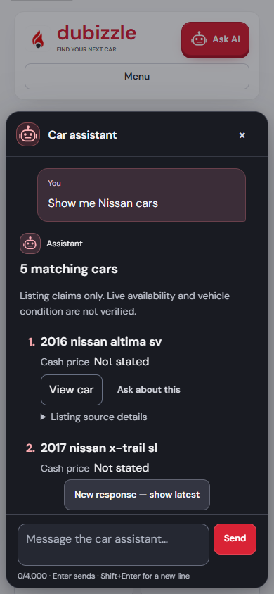

# Car Shopping Assistant

I built this assessment prototype to help someone find a car, ask follow-up questions, save their preferences and arrange a simulated viewing. It uses the supplied inventory and keeps missing listing facts visible.

**[Download the submission ZIP](https://github.com/Hasan-Al-Hussein/car-shopping-assistant/releases/download/assessment-submission-2026-09-25/Car-Shopping-Assistant-Submission.zip)** · [Run locally](#1-assessment-requirements) · [Extra features](#2-extra-features) · [Results](#3-verification-and-performance) · [Screenshot walkthrough](#4-screenshot-walkthrough)

## 1. Assessment requirements

This section follows the requested README points: setup, technical choices, two paragraphs on implementation and future work, and recorded multi-turn/new-session demonstrations. The original brief is included in `sources/`.

### Setup and execution

**New installation? Follow the [step-by-step ZIP installation guide](delivery/INSTALL.md): download, extract, install dependencies, initialize, activate, enter your key and open the website.**

Use Windows PowerShell with **Python 3.13.3**, **uv**, **Node 24.13+ within 24.x** and **npm 11.6.2+ within 11.x**. Python must already be installed; automatic Python downloads are disabled. A Google AI Studio project with confirmed free-tier access is needed for live chat. No paid fallback is configured.

This version runs locally on **Windows**. Native file locking and local SQLite persistence mean it is not a Linux-compatible or Vercel-hosted service.

Clone the repository, then open PowerShell in its root:

```powershell
git clone https://github.com/Hasan-Al-Hussein/car-shopping-assistant.git
Set-Location car-shopping-assistant
```

Alternatively, download the repository as a ZIP and extract it. Preserve the included workbook, bootstrap records and relative folders.

```powershell
Set-Location backend
uv sync --frozen
if ($LASTEXITCODE -ne 0) { throw 'Backend dependency installation failed.' }
Set-Location ../frontend
npm ci
if ($LASTEXITCODE -ne 0) { throw 'Frontend dependency installation failed.' }
Set-Location ..
```

Create one isolated local runtime for the database and CSV exports. Start from an ordinary PowerShell terminal without inherited `CSA_*`, provider-key, virtual-environment or custom `PYTHONPATH` overrides. Keep this terminal open for the backend.

```powershell
$csaProject = (Get-Location).Path
$csaCase = [guid]::NewGuid().ToString('N')
$env:CSA_RUNTIME_ROOT = Join-Path $env:LOCALAPPDATA ('CarShoppingAssistant/runtime/q11/' + $csaCase)
$env:CSA_RUNTIME_PHYSICAL_ROOT = $env:CSA_RUNTIME_ROOT
$env:CSA_STORE_PATH = Join-Path $env:CSA_RUNTIME_PHYSICAL_ROOT 'stores/demo.sqlite3'
$env:PYTHONPATH = (Join-Path $csaProject 'backend') + ';' + $csaProject
$csaEvidence = Join-Path $csaProject ('Records/build/BE-05/I7/runs/' + $csaCase)
uv run --project backend --frozen python scripts/bootstrap_inventory.py `
    --initialize-runtime-root --destination $env:CSA_STORE_PATH --evidence-directory $csaEvidence
if ($LASTEXITCODE -ne 0) { throw 'Bootstrap failed; preserve this runtime and inspect its evidence.' }
```

Next, complete the **first activation block** in [operator setup](delivery/operator-setup.md), in this same terminal. Bootstrap alone does not activate viewing slots. If a step fails, preserve the original instance and operation for reconciliation; do not delete exports or retry with a different identity. A fresh database inside an already used runtime is insufficient: CSV exports also belong to that runtime.

The commands above are the ordinary Windows setup. A packaged execution host with redirected application data needs its own verified logical/physical mapping; internal host launchers are not a prerequisite for assessors. The recorded clean installation used that mapped host and required its physical runtime directory to be provisioned before bootstrap. Ordinary same-root initialization is supported by the source; a separate unmapped-host installation was not executed.

### Run the backend and client

From the project root in the backend terminal, enter the key through a masked prompt. The backend reads its environment directly; it does not load a `.env` file.

```powershell
$csaKey = Read-Host 'Google AI Studio key (confirmed free access)' -AsSecureString
try {
    $env:GEMINI_API_KEY = [System.Net.NetworkCredential]::new('', $csaKey).Password
    uv run --project backend --frozen python main.py
} finally {
    Remove-Item Env:\GEMINI_API_KEY -ErrorAction SilentlyContinue
    $csaKey.Dispose()
}
```

In a **separate terminal** at the repository root:

```powershell
Set-Location frontend
npm run dev
```

Open **http://127.0.0.1:5173/__app** for the connected application when using `npm run dev`. Vite proxies `/api` to the FastAPI backend at `http://127.0.0.1:8000`; both ports must be free. Use these exact loopback addresses. Root `main.py` launches the complete application; `app.main:app` alone is only the foundation app. Interactive API docs are disabled; `/api/v1/health` reports capabilities. Keep credentials out of source, screenshots and frontend variables. Stop both processes with Ctrl+C when finished.

### Why I chose this setup

| Part | Choice | Reason |
| --- | --- | --- |
| Client | React, TypeScript, Vite | Responsive browsing, comparison and conversation in one interface. |
| API | Python, FastAPI, Pydantic | Typed requests and clear service boundaries. |
| Retrieval | Deterministic SQL/lexical search over the supplied workbook | Fits approximately 100 listings and preserves exact source facts. |
| Orchestration | Explicit intent routing and validated service calls | Keeps action rules and recovery inspectable without an additional agent framework. |
| State | SQLite and SQLAlchemy | Stores sessions, explicitly saved preferences and simulated transactions locally. |
| Language | Free Gemini Developer API, `gemini-3.5-flash-lite` | Interprets requests; strict backend validation and services control facts and writes. |

**Frontend decision:** I chose React to give the frontend a richer interface than the original Notebook/Streamlit options. I asked whether I could use this approach, and Priya approved it with the condition that I explain the setup and include a decision note. React adds a Node build step; the [decision note](delivery/decision-note.md) explains the choice. SQLite is explicitly permitted by the assessment. I didn't add an agent framework or vector database because both are optional and unnecessary for this dataset. Dependencies are locked in `backend/uv.lock` and `frontend/package-lock.json`.

### Implementation decisions and future work

In my implementation, retrieval, conversation, persistence and transaction rules are separate. Gemini returns structured intent; the backend validates it and builds grounded replies from listing evidence. I kept saving explicit so that discussing a preference or enquiry doesn't automatically store it. Booking review and recovery using the original operation prevent an uncertain response from becoming a duplicate appointment.

For future work, I'd improve verified price and availability coverage, multilingual understanding and evaluation across varied buyer language. I'd also reduce the frontend bundle and API latency and extend the accessibility checks. A shared deployment would require portable storage and locking, authentication and operational changes. These are improvements I'd consider next; they aren't delivered features or enabled integrations.

### Recorded conversation demonstrations

These excerpts come from actual FastAPI and Gemini runs. The full logs retain the original responses and session details. The response wording in those historical logs predates the current, shorter chat formatting.

**Exploring the inventory in one conversation**

The first result was the supplied Ford Explorer listing. Both follow-up questions kept that same car as context:

```text
User: Show me cars from the supplied inventory.
Assistant (excerpt): The inventory reports 100 supported matches; this page contains 20.

User: What is the mileage on the first car you just showed me?
Assistant (excerpt): The odometer mileage is not stated in the supplied evidence.

User: Is there a warranty on it?
Assistant (excerpt): The warranty is not stated in the supplied evidence.
```

[Read the full multi-turn conversation](delivery/evidence/multi-turn-conversation.md).

**Remembering preferences in a completely new session**

```text
Session A
User: Please explicitly remember these two soft requirements for future conversations:
      "quiet cabin" and "space for a folding bicycle". Save these preferences now.
Assistant: Your preference update is recorded.

Session B, using the same local user identity
User: What requirements did I ask you to remember in my earlier conversation?
      Tell me the saved values.
Assistant (excerpt): You saved requirements in another session (soft preference):
           "quiet cabin", "space for a folding bicycle".
```

[Read the new-session recall log](delivery/evidence/new-session-recall.md).

### Required capabilities and where to see them

| Requirement | Implementation and evidence |
| --- | --- |
| FastAPI chat, inventory and state endpoints | Root `main.py` starts the complete backend. The React interface calls its REST API. |
| Natural-language search over the supplied inventory | Gemini interprets requests; validated SQL/lexical retrieval searches the 100 supplied listings. [Conversation log](delivery/evidence/multi-turn-conversation.md). |
| Contextual follow-ups | The selected car and original result order persist within a session, as the mileage/warranty example shows. |
| Persistent preferences | SQLite stores explicitly saved preferences. [New-session recall](delivery/evidence/new-session-recall.md). |
| Simulated viewing slots | Monday to Saturday, 08:00 to 20:00 Dubai time, using 30-minute slots and an explicit review/confirmation step. [Setup and demo](delivery/demo/README.md). |
| Qualified leads saved to a local CSV | The enquiry flow records budget and needs. [Actual sample CSV](delivery/evidence/qualified-lead.csv) and [export evidence](delivery/evidence/qualified-enquiry.md). |
| Automotive scope and competitor restrictions | Fixed scope replies and validated output controls. [Competitor checks and coverage](delivery/evidence/competitor-output-check.md). |
| Free Google AI Studio access | The backend uses the configured free Gemini API. There is no paid fallback. |

To try the full flow, browse a car, open the assistant, give your budget and needs, save the enquiry, then review and confirm a simulated viewing. CSV exports are written to the runtime's `exports` folder. Viewing eligibility is a demo policy; no dealer is contacted and no real reservation is made.

The [HTTP demo guide](delivery/demo/README.md), [clean-install record](delivery/evidence/clean-setup.md) and [delivery evidence](delivery/evidence/release-review.md) explain the recorded execution. The conversation, booking and CSV demonstrations are separate runs; they do not establish one uninterrupted live chat-to-booking-to-CSV journey. A new browser identity represents a different local user.

## 2. Extra features

I added these to make the prototype useful beyond a basic chat window:

| Feature | What it adds |
| --- | --- |
| Compare up to three cars | View listing facts side by side and remove individual selections from the comparison tray. |
| Saved shortlist | Keep cars for later using the same local browser identity. |
| Filters with counts | Choose makes, models, trims and years from the supplied inventory; remove applied filters individually. |
| Spelling suggestions | Recover from searches such as `nisan` with a suggested inventory term. |
| Source details | Expand the evidence behind a fact and see missing or conflicting information. |
| Responsive interface | Desktop and mobile layouts, consistent navigation, keyboard focus and reduced-motion support. |
| Readable assistant panel | One conversation scroll area, clear replies and linked car results alongside the page. |
| Natural budget wording | `My budget is 20k dirhams` means an AED 20,000 purchase limit; ambiguous payment amounts still get a clarification. |
| Recovery for interrupted actions | Review the original operation or export status instead of accidentally creating a duplicate enquiry or viewing. |

I used the workbook's real car photos for listings. Page headers use separate decorative artwork. The interface has a consistent red, white and charcoal palette, hover feedback and subtle scroll entrances.

## 3. Verification and performance

The [verification summary](delivery/evidence/verification-summary.md) records the scope, dates and remaining limits of the executed checks.

| Check | Recorded result |
| --- | --- |
| Current frontend suite | **357 passed**, 28 test files, no failures or skips. |
| Focused backend answer-readability checks | **183 passed**; not the entire backend suite. |
| Frontend types and production build | Passed. Scoped lint passed with one existing warning; the earlier full lint run reported **8 warnings**. A large-chunk warning remains. |
| Responsive checks | **215** earlier controlled checks; separate chat reviews passed **49**, **7** and **7** checks with synthetic conversation fixtures. |
| Broader live AI run | **34/38 selected cases passed; 4 provider timeouts**. |
| Later targeted live AI run | **5 cases, 11 steps, 116 assertions passed**; separate from the earlier run, not a replacement for its failures. |
| Local API pilot | **200/200 valid responses**, zero request errors/timeouts, up to three overlapping requests. |
| Local API latency | Median **641 ms**, p95 **1,026 ms**, p99 **1,261 ms**. The project's **500 ms p95 target was not met**. |

The latency pilot used the provider-disabled local API, not live AI responses or an internet deployment. The 500 ms target is an additional project goal, not a PDF requirement. The final mobile tray correction passed 13 targeted tests and application/test TypeScript checks after the 357-test run. The latest frontend build reported 829.15 kB minified / 138.84 kB gzip for the warned chunk. The performance target remains unmet; a complete security audit and universal mobile compatibility haven't been established.

The final [competitor-output check](delivery/evidence/competitor-output-check.md) passed **386 focused offline tests** after correcting an evidence/recall edge case. This checks the reviewed names and variants; it is not an exhaustive guarantee for every platform.

My final [website and budget-language check](delivery/evidence/final-website-check.md) passed **279 focused backend tests** and **25 live local browser checks**. The exact phrase "my budget 20k dirhams" was also verified through the live interpreter and correctly applied an **AED 20,000 maximum**, without clarification. The linked record includes actual desktop/mobile screenshots and the scope of those checks.

## 4. Screenshot walkthrough

The screenshots below show the interface and the main browsing flow. Each caption identifies first-use or illustrative screens where relevant. The live conversation evidence is in section 1.

### 1. Homepage — search the supplied inventory from the cinematic landing page.



*actual public UI.*

### 2. Find a car — five Nissan matches with removable search criteria and original listing photos.



*actual public UI.*

### 3. Compare — Nissan Altima and X-Trail side by side.



*actual public UI.*

### 4. Car details — the original listing photograph and available facts.



*actual public UI, fresh capture.*

### 5. About — a brief introduction and return to the inventory.



*actual public UI.*

### 6. Shortlist — first-use browser access before saving private selections.



*actual first-use access state, not a populated shortlist.*

### 7. Help — guidance and browser access controls.



*actual public UI, fresh capture.*

### 8. Assistant — a readable car-results conversation, illustrated with synthetic fixture data.



*historical synthetic fixture UI render; not live provider proof.*

### 9. Mobile homepage — compact navigation and responsive car discovery.


*actual public UI.*

### 10. Mobile inventory — search and filters sized for a small screen.



*actual public UI.*

### 11. Mobile assistant — the same conversation layout on a phone; synthetic example.



*historical synthetic fixture UI render; not live provider proof.*

## 5. Download and repository guide

**[Download the complete submission ZIP](https://github.com/Hasan-Al-Hussein/car-shopping-assistant/releases/download/assessment-submission-2026-09-25/Car-Shopping-Assistant-Submission.zip)**. It contains the source, setup instructions, supplied inputs and the evidence shown here. Install the dependencies and provide your own free-tier key using the instructions above.

| Path | Contents |
| --- | --- |
| `main.py`, `backend/` | Complete FastAPI entrypoint, application services, persistence and locked Python dependencies. |
| `frontend/` | React client, bundled visual assets and locked Node dependencies. |
| `contracts/` | API schema and generated runtime contracts. |
| `sources/` | Original assessment PDF and supplied workbook. |
| `scripts/`, `fixtures/`, selected `Records/` | Bootstrap inputs, simulation configuration and operator tools needed to run the app. |
| `delivery/` | Setup and decision notes, demonstrations and verification evidence. |

This is my assessment prototype, not an official dubizzle service. Branding and asset provenance are documented in `References/`; their use doesn't imply affiliation. Credentials, personal conversations, runtime databases and private operational exports are excluded. The sample lead evidence uses synthetic buyer inputs.
