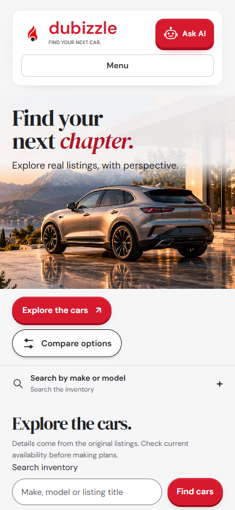

# Final website and natural-budget checks

I corrected the budget validation so ordinary wording such as “Help me find a car within my budget 20k dirhams” works without requiring the words “cash” or “AED”. The UAE app recognizes AED, Dhs and dirham(s). Explicit monthly payments, financing, conflicting currencies and ambiguous payment amounts still require clarification.

The focused offline run passed **279 tests**, with scoped lint and type checks passing. A separate live Gemini interpretation of that exact sentence applied an **AED 20,000 maximum purchase budget**, with no clarification. It used two normal adapter attempts and took 11.926 seconds. This was a fresh synthetic session; it did not read or change a user's history or prove a particular inventory result count.

The final browser check passed **25 checks** against the running local backend at desktop 1440×1000 and mobile 390×844 sizes. It covered the homepage, Nissan search (five supplied listings), two-car comparison, the selected car detail, About and its browsing link, Help, shortlist access and chat onboarding. No browser runtime exception or horizontal page overflow was observed in those checks. An independent review inspected desktop and mobile captures and found no blocking layout issue. The first runner had an incorrect read-only API interception rule, an insufficient loading wait and a menu-close selector error; after correcting those test issues, all checks passed without changing the application.

This check did not repeat private saving, booking confirmation or CSV export. Those capabilities have the earlier separately recorded demonstrations. It also does not establish one uninterrupted live chat-to-booking-to-CSV journey or every possible device and input.

One earlier interactive request returned an interpretation-unavailable response. Its original diagnostic was not retained, so I cannot identify its cause retrospectively. A fresh identical request subsequently succeeded. The budget-language issue was a separate validation problem, not proof of the earlier provider failure's cause. Live AI still depends on the external service and its free-tier availability.

## Actual rendered screens

