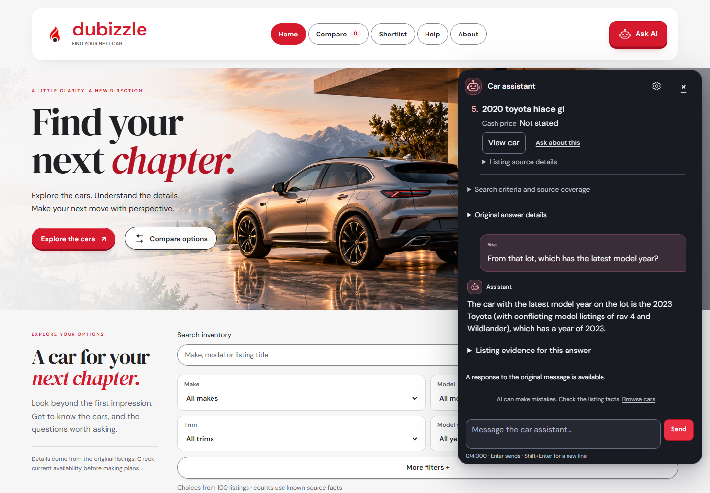
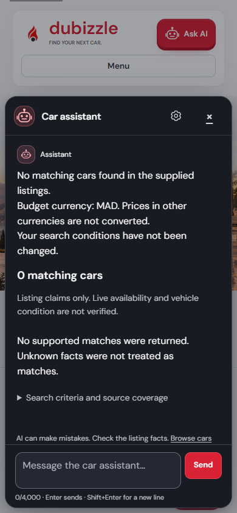

# Semantic conversation verification — 26 September 2026

I tested these eight messages through the real React interface, FastAPI backend and configured free Gemini service. The run used fresh synthetic conversations; responses were not mocked. Expected results came from the supplied 100-car inventory.

## What I changed

I removed the second command-word parser from ordinary shopping searches. Gemini interprets spelling, corrections and the conversation; the backend validates the resulting filters, exact numerical values and source facts. Changing one filter keeps the others. Search replies no longer need an interface checkbox to resolve an old question. Conversational references use the previous results without requiring a clicked car. Statistical questions use computed inventory statistics and a naturally composed answer.
The planner also receives a compact vocabulary from the active inventory, so it can map an intended badge or model to the catalogue's canonical spelling without an alias dictionary. The vocabulary does not count as evidence that a car matches; the subsequent search does.

An unqualified purchase budget uses AED in this UAE app unless the conversation already establishes another currency. Explicit foreign currencies remain explicit, with no conversion. Read-only discussion cannot save preferences or submit a booking. Existing source-grounding and competitor-output restrictions remain.
Internally contradictory search interpretations use the existing single model-repair attempt instead of immediately asking the buyer an unnecessary question. Genuine ambiguity can still require clarification. The interface displays that question once.
Every supplied row column now has a matching citation binding, including listing identifiers. Valid references to those identifiers no longer cause a correct model answer to be rejected as a service failure; unknown or wrong-row citations still reject.

## Actual conversations

### A1 — what toyata cars do u offer?

**Assistant:**

> Found 5 matching cars in the supplied listings.
> 
> 1. Make: "toyota". Model: "camry". Year: 2018.
>    Price: AED 36,999.00 cash (seller claim).
> 
> 2. Make: "toyota". Model: "highlander". Year: 2021.
>    Price: not stated.
> 
> 3. Make: "toyota". Model: "land cruiser". Year: 2009 (seller claim).
>    Price: not stated.
> 
> 4. Make: "toyota". Model: conflicting listing values — "rav 4" versus "Wildlander". No value is resolved. Year: 2023.
>    Price: AED 95,000.00 cash (seller claim).
> 
> 5. Make: "toyota". Model: "hiace". Year: 2020.
>    Price: not stated.
> 
> Confirm current availability and condition with the seller.

Observed response time: 7.69 seconds.

### A2 — i meant toyota

**Assistant:**

> Found 5 matching cars in the supplied listings.
> 
> 1. Make: "toyota". Model: "camry". Year: 2018.
>    Price: AED 36,999.00 cash (seller claim).
> 
> 2. Make: "toyota". Model: "highlander". Year: 2021.
>    Price: not stated.
> 
> 3. Make: "toyota". Model: "land cruiser". Year: 2009 (seller claim).
>    Price: not stated.
> 
> 4. Make: "toyota". Model: conflicting listing values — "rav 4" versus "Wildlander". No value is resolved. Year: 2023.
>    Price: AED 95,000.00 cash (seller claim).
> 
> 5. Make: "toyota". Model: "hiace". Year: 2020.
>    Price: not stated.
> 
> Confirm current availability and condition with the seller.

Observed response time: 4.61 seconds.

### A3 — From that lot, which has the latest model year?

**Assistant:**

> The car with the latest model year on the lot is the 2023 Toyota (with conflicting model listings of rav 4 and Wildlander), which has a year of 2023.

Observed response time: 8.37 seconds.

### B1 — Find Lancia cars for no more than 50k

**Assistant:**

> No matching cars found in the supplied listings.
> Budget currency: AED. Prices in other currencies are not converted.
> Your search conditions have not been changed.

Observed response time: 7.21 seconds.

### B2 — Sorry, Toyota's the one I had in mind.

**Assistant:**

> Found 1 matching car in the supplied listings.
> Budget currency: AED. Prices in other currencies are not converted.
> 
> 1. Make: "toyota". Model: "camry". Year: 2018.
>    Price: AED 36,999.00 cash (seller claim).
> 
> Confirm current availability and condition with the seller.

Observed response time: 5.00 seconds.

### B3 — What model year is that one and how much does it cost?

**Assistant:**

> The Toyota Camry is from the 2018 model year and costs AED 36,999.00 cash.

Observed response time: 6.84 seconds.

### C1 — Show Mercdes vehicles.

**Assistant:**

> Found 20 matching cars in the supplied listings.
> 
> 1. Make: "mercedes-benz". Model: "c-class". Year: 2020.
>    Price: not stated.
> 
> 2. Make: "mercedes-benz". Model: "c-class". Year: 2019.
>    Price: not stated.
> 
> 3. Make: "mercedes-benz". Model: "glc coupe". Year: 2019.
>    Price: not stated.
> 
> 4. Make: "mercedes-benz". Model: "c-class". Year: 2020.
>    Price: not stated.
> 
> 5. Make: "mercedes-benz". Model: "c-class". Year: 2023.
>    Price: not stated.
> 
> The first 5 cars are summarized here; the attached results include the rest of this page.
> 
> Confirm current availability and condition with the seller.

Observed response time: 5.92 seconds.

### C2 — Now only up to 50000 Moroccan dirhams, not UAE dirhams.

**Assistant:**

> No matching cars found in the supplied listings.
> Budget currency: MAD. Prices in other currencies are not converted.
> Your search conditions have not been changed.

Observed response time: 4.28 seconds.

## Executed checks and limits

- Full assistant run: **1,412 passed, two failed**. Both failures were obsolete statistics fixtures, corrected and included in a final **50-passing-check** run of conversation, context and vocabulary tests. The full suite was not repeated after the final vocabulary addition; its separate **six catalogue tests passed**. The full run includes the 46-case composed evaluation. Two warnings came from deliberate malformed-model tests.
- Final backend coherence/provider/conversation checks: **84 passed**. After the purchase-default adjustment, **112 semantic-search, coherence and conversation checks passed**; the final citation-contract adjustment passed **101 grounding checks**. These overlap with the full suite and are not added to its count.
- Frontend: application TypeScript check and **55 conversation-content/panel tests** passed. The later chat cleanup passed **78 content/panel/flow tests** and TypeScript checking. Those test sets overlap and are not added together. The previous recovery's broader frontend checks remain historical.
- Eight real browser messages passed the checked criteria/result/evidence assertions. Replies and desktop/mobile screenshots were reviewed independently.
- After that live run, I restricted listing-ID citations to identity references so their digits cannot support a price, year or mileage. This changes only local validation, not model inputs. The actual grounded replies from that run passed an independent offline replay against the final validator; I did not claim a second full browser run after this last adjustment.
- Observed response times: **4.28–8.37 seconds**, median **6.38 seconds**. This is a small local live-model sample, not a throughput benchmark or latency guarantee.

Earlier runs exposed reference failures, missing citation bindings and a contradictory currency interpretation; I fixed those paths and repeated the conversations. Two earlier runs also had intermittent local request failures, not reproduced in the accepted run; this is not proof that timeouts are eliminated. Passing examples do not guarantee every possible AI response. History and source inputs are bounded, provider failures remain possible, and unsupported or missing inventory facts remain unavailable. No new clean-host installation or public deployment is claimed by this change.

## Screenshots

These captures show the accepted live AI run before the later chat cleanup. The current interface removes technical source/answer dropdowns and the routine success notice; full listing details are available through View car.

